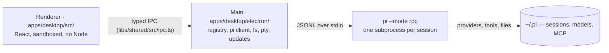

<picture>
  <source media="(prefers-color-scheme: dark)" srcset="apps/desktop/build/icon.svg">
  <source media="(prefers-color-scheme: light)" srcset="apps/desktop/build/icon-light.svg">
  
</picture>

# Phosphor

**The [pi coding agent](https://www.npmjs.com/package/@earendil-works/pi-coding-agent),
extended into a desktop IDE for macOS, Linux and Windows.**

[](https://phosphor.saccolabs.com)
[](https://github.com/agustinsacco/Phosphor/actions/workflows/ci.yml)
[](https://github.com/agustinsacco/Phosphor/releases/latest)
[](https://github.com/agustinsacco/Phosphor/releases)


Open a folder, describe a task, work beside the agent. The chat renders what
models actually produce (diffs, diagrams, charts, sandboxed HTML). The file
explorer and terminal sit next to it. Every change the agent made is there to
review or revert.

One window, every provider pi speaks: Anthropic, OpenAI (API key or ChatGPT
subscription), Google Gemini and Vertex, Azure OpenAI, Amazon Bedrock, Mistral,
Groq, Cerebras, xAI, OpenRouter, the Cloudflare and Vercel gateways, plus your
Claude Pro/Max subscription through
[pi-claude-cli](https://github.com/agustinsacco/pi-claude-cli). Switch models
mid-session; the conversation comes along.

|                                             |                                         |
| ------------------------------------------- | --------------------------------------- |
| **Chat, diffs, files, terminal, artifacts** | One window, side by side                |
| **Multi-provider by design**                | Any pi provider, switchable mid-session |
| **Sessions are real pi processes**          | Nothing invented, everything reachable  |
| **Runs on your metal**                      | Your models, your keys, your files      |


## Quick start

```bash
# 1. pi is the engine — Phosphor needs it on your PATH (Node ≥ 22.19)
npm install -g @earendil-works/pi-coding-agent

# 2. Install Phosphor (macOS / Linux; Windows: run the .exe from the latest release)
curl -fsSL https://github.com/agustinsacco/Phosphor/releases/latest/download/install.sh | sh
```

Launch Phosphor, open a folder, sign in to a provider (run `pi` in the built-in
terminal and use `/login`, or put API keys / a local endpoint in
`~/.pi/agent/`). Describe a task, press Enter. Alternatives are under
[Install](#install).

## What Phosphor does

- **Sessions are real pi subprocesses.** One `pi --mode rpc` per live session,
  spawned in the workspace folder. Everything pi exposes over RPC is in the UI:
  models, thinking levels, steering and follow-up queues, compaction,
  auto-retry, forks, clones, export.
- **No permission prompts.** pi runs in full-permission mode. Tool calls run and
  stream their results.
- **Local routines.** Save instructions, choose a workspace/model and a preset or
  cron schedule, and get a fresh lane per run. Persistent history, catch-up,
  cancellation, and optional background operation. Requires the computer awake;
  agents retain full tool permissions. [Routines](docs/routines.md).
- **Rich responses are first-class.** GFM markdown, highlighted code, Mermaid,
  Chart.js and Vega-Lite specs, KaTeX, and model-authored HTML in a sandboxed
  iframe.
- **Every change is reviewable.** The Changes panel holds the agent's edits as
  per-file diffs against a session baseline, with per-file revert.
- **Session tree.** See the branch structure, jump to any point, fork from it,
  bookmark it.
- **Artifacts.** A bundled extension adds `artifact_create` / `artifact_edit` /
  `artifact_update`. Deliverables land in a versioned side panel with previews
  and diffs, and survive compaction, restarts and session deletion in an
  artifact store.
- **Your machine, your models.** Sign in to providers, pick models, set themes,
  mount MCP servers from Settings. MCP OAuth belongs to the adapter, never to
  Phosphor: [docs/mcp.md](docs/mcp.md).

## The screens

Every session pairs the transcript with one switchable pane: Files, Changes,
Terminal or Artifacts. The pane docks left or right (persisted per session) and
can go fullscreen. Every shot below is the app against a real pi, real
providers and real tokens; see
[the screenshots in this README](#the-screenshots-in-this-readme).

### Home — where a session starts

Pick the folder, the branch (or a fresh worktree branch off trunk), the model,
and go. The sidebar lists every session with live state, edit counts, a
worktree badge and the PR badge once one exists.

Above the composer is the **lane board**: this project's lanes in columns by
what they need from you (waiting on you, ready to merge, needs a push, in
review, running), each card carrying the one action that unblocks it. Below it,
a **ledger** of what the parallelism costs: spend, tokens, live processes, and
the account window that will stop you first.

Nothing there polls or spends tokens. Every column is derived from state the
app already holds, so the board is right with no live session and after a
restart.


### Chat — the transcript, not a blob

Streaming text with the run's activity folded into steps: edits expand to their
diff, tool calls to their arguments and output, thinking to its own block. The
composer takes `@` file references, `/` commands, `!` shell lines, and queues
follow-ups while a turn is running.


### The composer — every model, every provider, one chip away

The model chooser lists everything you are signed into, native providers and
installed provider packages alike. Searchable, starrable, switchable
mid-session. The chip names what actually serves the session (`pi-claude-cli`
when it is your Claude subscription):


Models with a thinking ladder get a second chip for effort:


The context meter opens into a live breakdown of the window: what the system
prompt, tools and conversation cost, and your plan's rate-limit window on
subscription providers:


`/` opens commands, `@` mentions workspace files:


### Files — explorer and editor, on whichever side you like

Create, rename, Trash, multi-select, copy/cut/paste, drop files and folders
in, all beside a Monaco editor. Docked right by default.
[File management details](docs/files.md):


One click moves the pane to the left. The choice is per session and persists:


Any pane can take the whole session region when the transcript is not the thing
you are reading:


### Terminal — real shells in the workspace

Real terminal tabs against the workspace, owned by the session that opened
them, so the transcript never loses its place.


### Artifacts

Long documents, HTML pages, SVG, Mermaid and chart documents the model creates
for you. Versioned, previewable, diffable, and kept in a store that outlives
compaction and the session itself.


### Settings — and it is not only dark

Appearance, agent, accounts, extensions, connectors, workspaces, optimization,
advanced, keybindings, about. Light theme included, because diff review at 2am
is a real workflow.


Accounts is where providers sign in, subscription or API key, per provider:


Connectors mounts MCP servers (Notion, Linear, anything with an MCP endpoint).
OAuth is the adapter's, never Phosphor's:


The light theme, on the edit session:


## Install

macOS and Linux:

```bash
curl -fsSL https://github.com/agustinsacco/Phosphor/releases/latest/download/install.sh | sh
```

The script installs the AppImage on Linux and the `.app` bundle on macOS, and
verifies the download against the release's `checksums.txt`. Binaries are also
on the [Releases page](https://github.com/agustinsacco/Phosphor/releases): DMG
and ZIP for macOS, AppImage and `.deb` for Linux.

Windows: download `Phosphor-<version>-x64.exe` from the
[latest release](https://github.com/agustinsacco/Phosphor/releases/latest) and
run it. It installs per user (no administrator prompt) and picks its own
install folder unless you change it. The installer is not code-signed, so
SmartScreen shows "Windows protected your PC" — choose **More info → Run
anyway**. Install pi with `npm install -g @earendil-works/pi-coding-agent` in
any terminal; Phosphor finds it on the user PATH that npm sets up. A Node
version manager that only configures PATH per terminal (fnm, nvm-windows
without a system-wide link) is not visible to a desktop app, and the setup
screen says so.

Phosphor needs `pi` on your PATH:

```bash
npm install -g @earendil-works/pi-coding-agent
```

The app shows a setup screen until pi is available. Sign in by running `pi` in
Phosphor's built-in terminal and using `/login`, or configure API keys / a local
endpoint in `~/.pi/agent/`.

### Updates

Successful same-repository CI pushes to `main` publish a release when the
Desktop app changed since the last published release (Nx `desktop` affected;
see [docs/nx-cache.md](docs/nx-cache.md#per-app-releases-and-deploys)), unless
the commit has a `Skip-Release: true` trailer. Site, schema, docs and CI-only
merges do not release. The guard supports both script layouts
in the validated checkout and blocks publication if missing or broken. Releases
are versioned `0.1.<commit count>`. An installed app checks at launch and every 30 minutes;
when there is something to do, an update button appears in the sidebar footer
above Settings.

Linux AppImage, Windows and signed macOS installs download in the background
and offer "Restart to update". Unsigned macOS and `.deb` installs cannot
replace their own files, so they link to the release page. Update checks only run when
packaged. Details: [docs/updates.md](docs/updates.md).

## How it works

One `pi --mode rpc` subprocess per live session, spoken to over JSONL on stdio.
Phosphor never imports pi's code. The protocol is hand-mirrored in
[`libs/shared/src/rpc.ts`](libs/shared/src/rpc.ts) with compile-time drift guards, so a protocol
change this file has not caught will not compile.



Six facts that explain the rest:

1. **The main process owns all side effects.** The renderer runs sandboxed
   (`contextIsolation`, no Node) and is pure UI over typed IPC. Disk, network
   or a subprocess means `apps/desktop/electron/`, not `apps/desktop/src/`.
2. **IPC is a typed contract.** A new channel is an entry in `libs/shared/src/ipc.ts`'s
   `IpcInvokeMap`, a handler in the matching `apps/desktop/electron/ipc/<prefix>-handlers.ts`,
   and a case in `apps/desktop/src/dev/mockPhosphor.ts`.
3. **Stores (`apps/desktop/src/stores/`) are projections of main-process state**, not a
   second source of truth. The chat store keeps a session's live title, tokens
   and context meter honest while a turn runs.
4. **Sessions are files.** pi writes a session's JSONL when a turn _ends_. The
   sessions list is a scan of pi's session directory. Phosphor appends to those
   files for bookmarks, branch jumps and forks, which is only safe while no pi
   process owns the file.
5. **Six extensions run inside pi's process** (`libs/pi-extensions/pi-ext/`, loaded with `-e` into
   every session): `artifacts`, `context-breakdown`, `headroom`, `mcp-status`,
   `tool-name-guard`, `worktree-paths`. Two of them can change or refuse what
   the model did: [docs/extensions.md](docs/extensions.md).
6. **Failure is reported, not hidden.** Failures land on the session's chat;
   main-process detail goes to `phosphor.log`. For a bad session,
   [CLAUDE.md](CLAUDE.md#debugging-a-failing-session) has the three layers of
   evidence and the one command that decides Phosphor-vs-pi.

## Development

Requires Node 22+ (pi itself needs ≥ 22.19) and `pi` on PATH for `npm run dev`.

```bash
npm install
npm run dev
```

| Script               | Purpose                                                        |
| -------------------- | -------------------------------------------------------------- |
| `npm run dev`        | Electron + Vite dev server with HMR                            |
| `npm run dev:web`    | Renderer alone, in a browser, against the mock preload API     |
| `npm run build`      | Bundle main, preload and renderer to `apps/desktop/out/`       |
| `npm run typecheck`  | TypeScript project checks (main + renderer)                    |
| `npm run lint`       | ESLint                                                         |
| `npm run format`     | Prettier                                                       |
| `npm test`           | Vitest unit tests                                              |
| `npm run test:e2e`   | Playwright-Electron smoke tests against the deterministic `pi` |
| `npm run validate`   | All of the above, quiet — one PASS/FAIL line per step + a log  |
| `npm run pack`       | Package for the current platform without packing (quick check) |
| `npm run dist`       | Package for the current platform via electron-builder          |
| `npm run shots`      | Deterministic screenshots against the e2e pi stub (see below)  |
| `npm run shots:live` | Re-shoot this README against a real pi instance (see below)    |

Tests live beside their subject as `*.test.ts`, in `apps/desktop/electron/`, `apps/host/src/`,
`libs/shared/src/` and `libs/pi-extensions/pi-ext/` included.

### Nx task orchestration

Core Nx is pinned to `23.2.1`. Nx-scoped security overrides pin `axios` to
`1.20.0`, `brace-expansion` to `5.0.12` and `smol-toml` to `1.9.0`, overriding
upstream's exact vulnerable pins. Remove these overrides when a tested upstream
release fixes them. npm also hoists the `brace-expansion` security patch from
`5.0.9` to `5.0.12` for existing root `minimatch` consumers (ESLint and
app-builder-lib); this is the sole pre-existing dependency resolution change.
Older nested packaging dependencies still have baseline audit findings; the
Nx wrapper does not claim to fix those. Override API smoke tests use no network.

The original npm commands above remain the
validation and CI path. Optional `npm run nx:build`, `nx:typecheck`, `nx:lint`,
`nx:test`, `nx:test:e2e` and `nx:validate` wrap those same underlying commands,
without redirecting the original aliases to Nx. `npm run nx:graph` shows the
explicit current-path ownership graph; `npx nx show project tooling --json`
shows effective targets. `npm run nx:test -- --configuration=inventory` lists
the same full unit suites without running them.

| Project         | Current paths / ownership                                           |
| --------------- | ------------------------------------------------------------------- |
| `desktop`       | `apps/desktop/`, plus screenshot assets at `docs/img/`              |
| `host`          | `apps/host/`, the plain-Node Host CLI ([host.md](docs/host.md))     |
| `runtime`       | `libs/session-runtime/src/`, including plain-Node and fake-pi tests |
| `shared`        | `libs/shared/`                                                      |
| `pi-extensions` | `libs/pi-extensions/pi-ext/`, including optional extension tests    |
| `site`          | `apps/site/`, with its independent install and lockfile             |
| `schema`        | `supabase/`, with explicit start/test/stop lifecycle                |
| `tooling`       | `tools/scripts/`, including workspace-wide checks                   |

Every target remains uncached, with conservative whole-workspace inputs,
including nested projects. Nx runs at most three tasks by default and bounds
each unit target to two Vitest workers. It has no inference plugins, daemon or
Cloud connection, and explicitly keeps default per-worktree cache/state in
ignored `.nx/`. No affected-only selection is introduced.
[nx-cache.md](docs/nx-cache.md) defines the cache ineligibility, declared outputs,
resource bounds and original uncached validation contract. Desktop owns its isolated native install
and lifecycle, described in [desktop-build.md](docs/desktop-build.md). Site targets use its existing npm commands from `apps/site/`, retaining
its social-image prebuild; schema targets retain the pinned local Supabase
commands and require explicit lifecycle cleanup. Neither is invoked by the
normal root validator unless its existing opt-in applies.

Project edges include source dependencies, extension resources, screenshot
assets, fixtures and workspace-wide tooling consumers, not just production
imports: the extensions project depends on shared because the optional
permission-gate test imports the shared command-approval parser, and tooling
checks consume all projects while Desktop uses tooling scripts. No library
depends on an app, so a Desktop-only change selects only `desktop` and
`tooling`, and a Host-only change only `host` and `tooling`. Targets have no recursive
`^test`/`^build` task dependencies, so their executable task graphs remain
acyclic. `tools/scripts/nx-projects.test.ts` checks the effective graph and targets,
including missing-edge/target fixtures. App-relative `out/`, packaging metadata and resource destinations are unchanged.
Root npm aliases delegate to Desktop; the app owns its Electron postinstall.
The root npm workspaces contain only `libs/shared`, `libs/session-runtime` and
`libs/pi-extensions`. Desktop and the site retain independent locks and real
installation directories. The [installation contract](docs/installations.md)
defines the supported scoped source-production recipe, script suppression,
source bundling and native ABI separation. This is not universal single-lock
consolidation.

`@phosphor/shared` is a private source-only package at `libs/shared`. Its
explicit subpath exports cover the complete shared module set, with adjacent
tests excluded from exports. Electron main/preload and renderer/browser builds
bundle its sources, rather than requiring workspace TypeScript at runtime.
The existing `@shared/*` spelling is the sole compatibility alias, mapped to
`libs/shared/src` in TypeScript, Vitest and both Vite configurations. It remains supported by configured source builds; installation closure does not
require a semantic split or a repository-wide import rewrite.
`@phosphor/session-runtime` exports the Electron-free modules from
`libs/session-runtime/src`, with a standalone Node TypeScript configuration.
Desktop main/preload and the plain-Node acceptance fixtures bundle these source
exports, and the Host imports them. Tests and fake-pi fixtures remain adjacent but are not package exports.
Core Nx derives a static runtime-to-shared edge from the private package manifest;
the explicit implicit edge remains too. Graph checks require both edge types,
while comparing unique targets for reachability. No import-inference plugin is enabled.

Conventions (IPC channels, the `piCall` rule, modals, and the sharp edges worth
knowing before touching pi's session files) are in [CLAUDE.md](CLAUDE.md). It
is written for coding agents and is the shortest accurate orientation for a
human too.

### The screenshots in this README

They are captures of the app against a **real pi instance**: the developer's
own `~/.pi`, real signed-in providers, a real repo, two metered model turns.

```bash
npm run build && npm run shots:live
```

The live runner (`tools/scripts/capture-live-shots.mjs`) isolates app prefs but not
pi. It runs one small edit task in a disposable worktree and one artifact task,
then shoots the transcript, panes, menus and popovers. It spends real tokens
and leaves the sessions and worktree behind; delete them like any other
session. `ONLY=models,context` re-shoots a subset (the turns still run);
`WORKSPACE=… TASK_EDIT=… MODEL_ARTIFACT=…` re-aim it. Email addresses on
screen are masked before every shot, and `REDACT='from=to,…'` masks anything
else private, like an internal MCP server's name or host.

`npm run shots` (`tools/scripts/capture-readme-shots.mjs`) is the deterministic
sibling: same mechanics, scratch workspace, the e2e `pi` stub, no key, no
network. Use it to verify UI changes; use the live one to regenerate what this
README shows.

### Repo layout

This tree is the single source of truth for "what lives where". `CLAUDE.md` and
[docs/architecture.md](docs/architecture.md) link here rather than keeping
copies.

```
apps/desktop/electron/            main process — owns every side effect
  main.ts            app lifecycle, window creation, quit teardown
  preload.ts         the contextBridge surface (one typed `subscribe` helper)
  ipc.ts             composition root: calls the per-domain handler registrars
  ipc/               one module per channel-prefix family — 19 of them today
                     (app, artifacts, claude-auth, clipboard, feedback, fs, git,
                      maintenance, mcp, optimization, packages, pi-auth,
                      pi-config, pi-session, pty, routines, sessions, skills,
                      updates) plus handle.ts, the
                      envelope unwrapper. The contract lives in libs/shared/src/ipc.ts;
                      ipc.ts is the composition root, so a handler module
                      never imports it back.
  registry.ts        the live pi session registry
  routines/          local scheduler, SQLite run ledger, unattended execution,
                     background tray; never manages interactive lanes
  broadcast.ts       send a push to every open window
  pi/                desktop RPC adapter, session scanner, writer, paths,
                     print mode, model catalogue, login flow
  claude/            pi-claude-cli: several Claude Code logins side by side,
                     which one bills a session (decided once, at spawn), and
                     live subscription usage
  headroom/          Headroom proxy supervisor (adopt/spawn/kill) + install job
  optimization/      the Advisor rules engine (pure functions, advice only)
  pty/               node-pty manager + spawn-helper repair
  fs/                file service, git service/sync/worktrees (over the
                     runtime library's git/),
                     workspace watcher, workspace search (worker thread)
  artifacts/         the `phosphor-artifact://` protocol — model HTML on its
                     own origin, so it runs JS without weakening the app CSP;
                     and the artifact store's indexer and library
  maintenance/       worktree reclaim: a pure policy that judges, a sweep that
                     does the git and the disk, a scheduler that rate-limits it
  updates/           update check + download state machine
  store.ts           app prefs (electron-store, constructed lazily)
libs/session-runtime/src/  Electron-free source modules, not a separate service
  pi/                pi RPC transport, strict LF JSONL framing, activity tracking,
                     session ownership, startup/policy preparation, command/resume
                     admission and deletion coordination with machine-local ports;
                     the reads behind those ports (pi settings, packages, versions,
                     forwarded env names)
  file-log.ts        injected file logging
  git/               the one git runner, repository/worktree info and its cache
  bundled-extensions.ts  bundled extension paths
supabase/            isolated control-directory migrations and local RLS tests
libs/shared/src/     types and pure logic shared by main + renderer
  ipc.ts             the typed IpcInvokeMap contract
  rpc.ts             hand-mirrored copy of pi's RPC protocol + drift guards
  models.ts          model catalogue and shared app types
apps/desktop/src/                 renderer (React) — pure UI over typed IPC
  app/               shell: App, TopBar, workspace picker, global shortcuts
  features/          one folder per surface (15): chat, sessions, files,
                     terminal, artifacts, settings, home, worktrees,
                     workspaces, palette, updates, connectors, extension-ui,
                     skills, routines
  components/        cross-feature primitives (Modal, PopupMenu, form, icons,
                     markdown renderers; search/: the find bar, its toggles,
                     finding and painting text in rendered DOM)
  stores/            zustand stores — projections of main-process state
  lib/               framework-free helpers (format, path, rpc, fuzzy, time…)
  styles/            the Phosphor design tokens
  assets/            the bundled fonts
  dev/               browser-only mock of the preload API (never bundled)
libs/pi-extensions/pi-ext/  the six pi extensions that run inside pi's process,
                     bundled into every session: artifacts, context-breakdown,
                     headroom, mcp-status, tool-name-guard, worktree-paths
apps/desktop/e2e/                 Playwright-Electron smoke tests + deterministic pi stub
apps/host/           the plain-Node Host and its `phosphor` CLI (src/, and
                     scripts/build.mjs for the bundle): its config, pi's
                     environment, the machine checks and the session runtime
                     (docs/host.md)
tools/scripts/             install.sh, icon + screenshot generation, release and
                     validate helpers
docs/                living technical docs — one file per surface, each
                     rewritten in the same diff as the behaviour it describes;
                     plus known-issues.md, defects that reproduce today
docs/img/            the screenshots above (assets, not documentation)
apps/site/           phosphor.saccolabs.com — the Astro landing page, real
                     captures, nginx image and browser checks (apps/site/README.md)
.infra/phosphor-site/  the k3s manifests the Deploy Site workflow applies
```

The main process owns all side effects. The renderer runs with
`contextIsolation`, no Node integration, and a strict CSP. Model-authored HTML
only ever renders inside a sandboxed iframe.

## Documentation map

| Read                                             | When                                                      |
| ------------------------------------------------ | --------------------------------------------------------- |
| [CLAUDE.md](CLAUDE.md)                           | Orientation, conventions, sharp edges, debugging          |
| [docs/README.md](docs/README.md)                 | The map: which file owns which fact                       |
| [docs/](docs/)                                   | How Phosphor works now (architecture, extensions, MCP, …) |
| [docs/known-issues.md](docs/known-issues.md)     | Defects that reproduce today, with the file that has them |
| [docs/architecture.md](docs/architecture.md)     | Process model, IPC design, cross-cutting requirements     |
| [docs/pi-integration.md](docs/pi-integration.md) | pi's RPC protocol and session format                      |

`docs/` describes shipped behaviour, present tense. A doc is part of the diff
that changes its behaviour, not a follow-up. There is no dated log and no spec
folder; git is the history. The one file that records what is _wrong_ rather
than how something works is [docs/known-issues.md](docs/known-issues.md), and a
row leaves it in the same diff that fixes the code.

## Contributing

Issues and PRs are welcome. Run `npm run validate` before opening a PR. If your
change moves behaviour a `docs/` file describes, update that file in the same
diff.

## License

MIT
