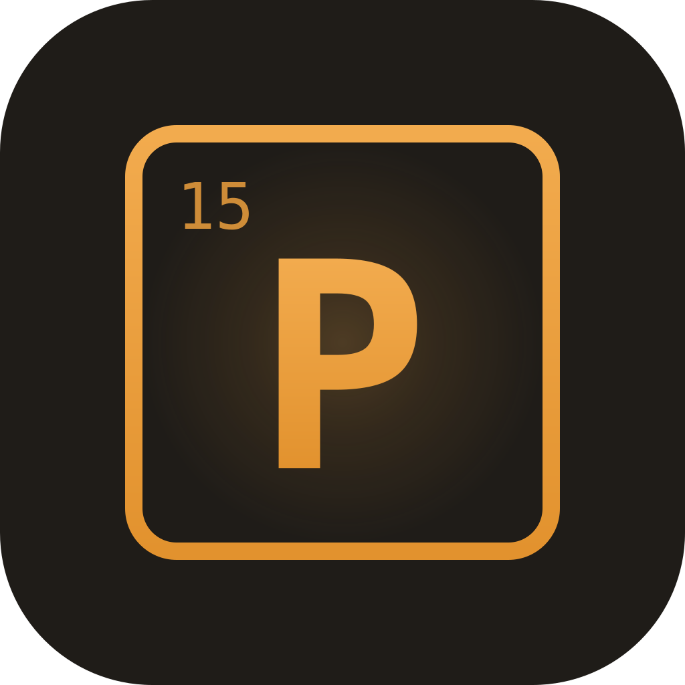
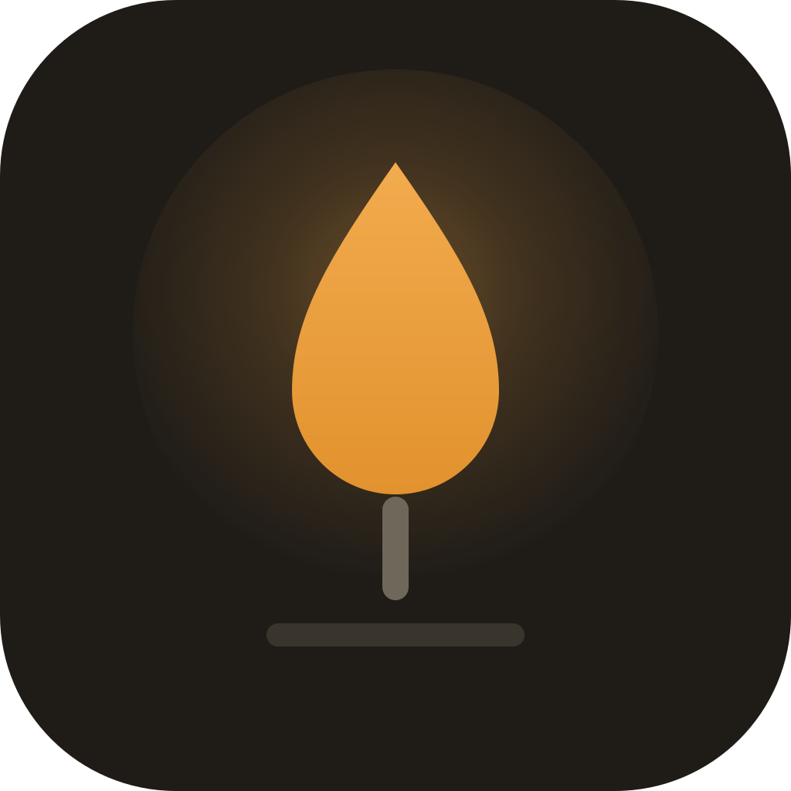
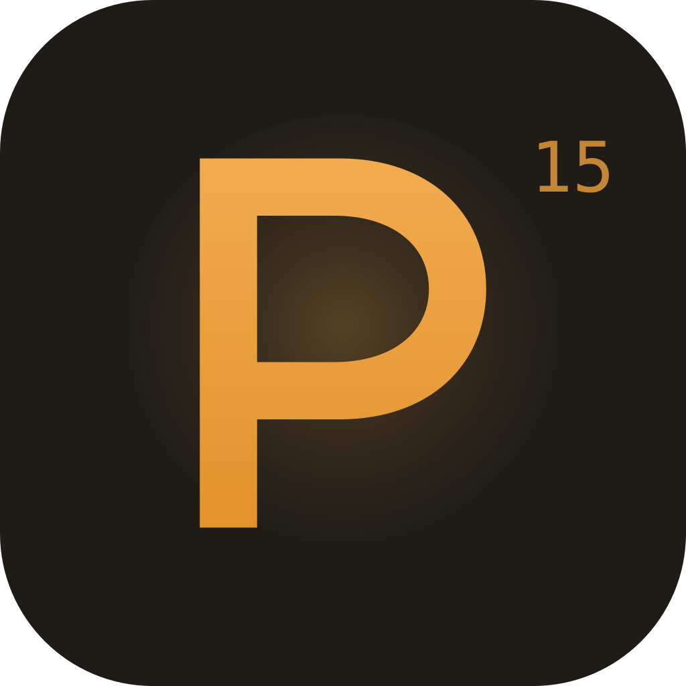
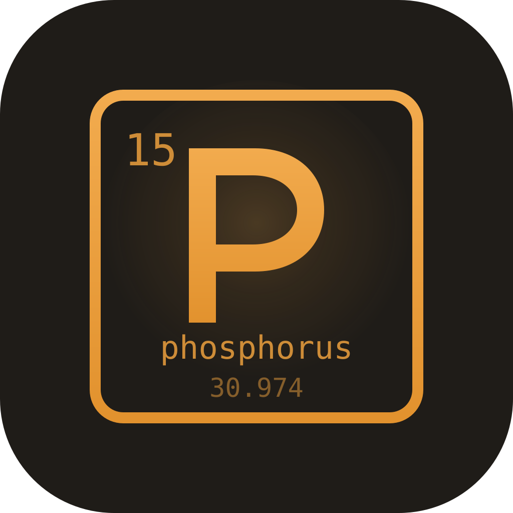
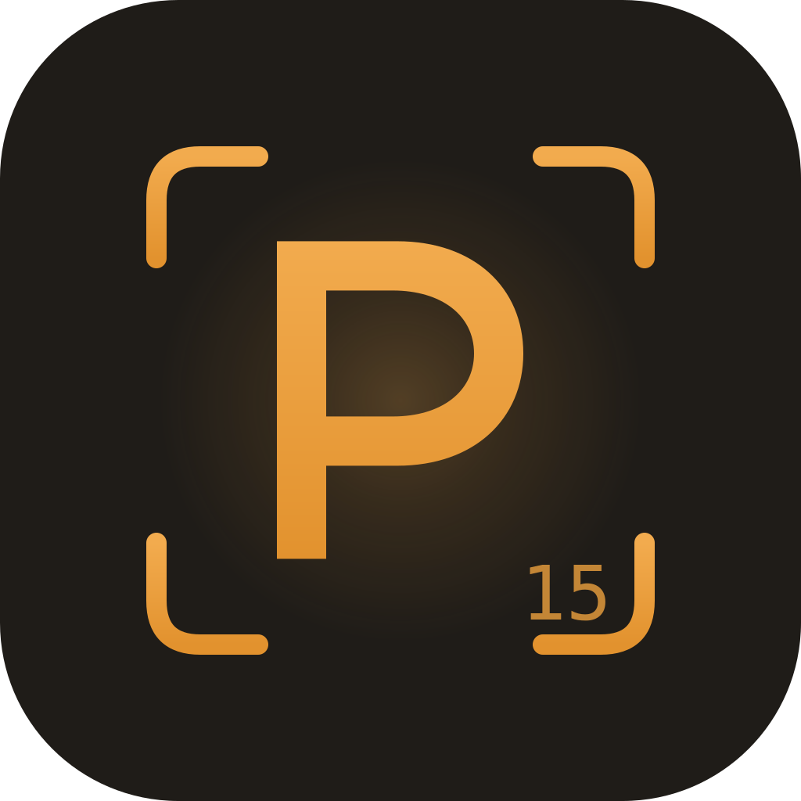
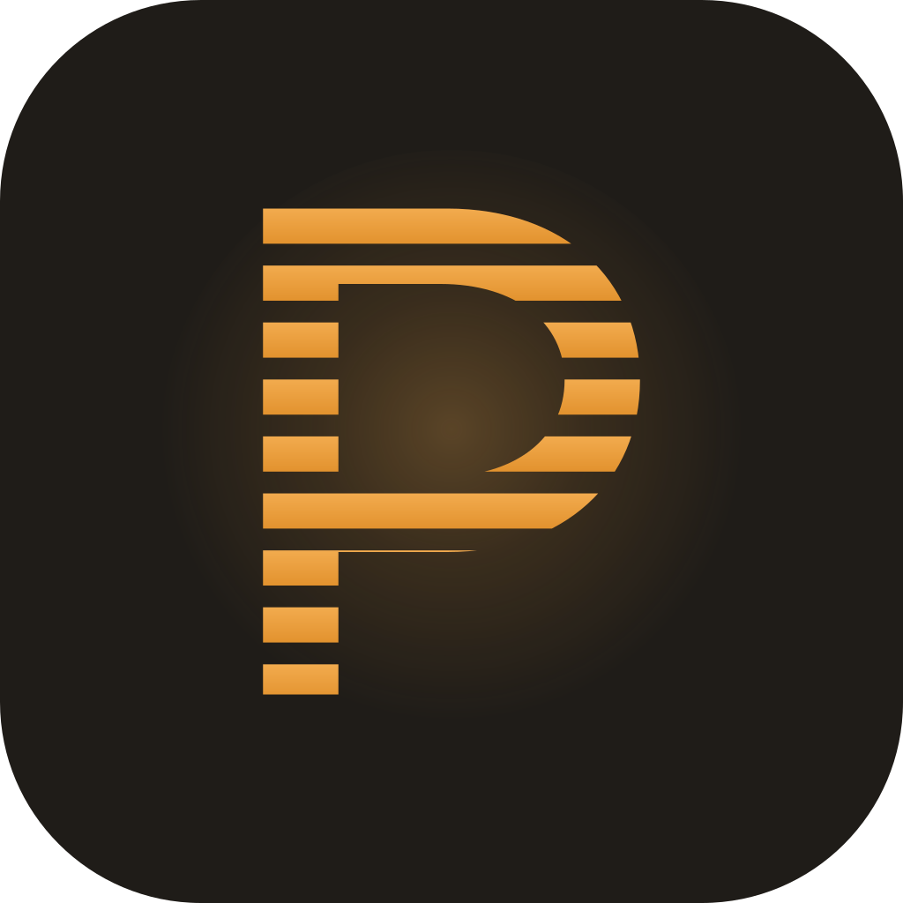
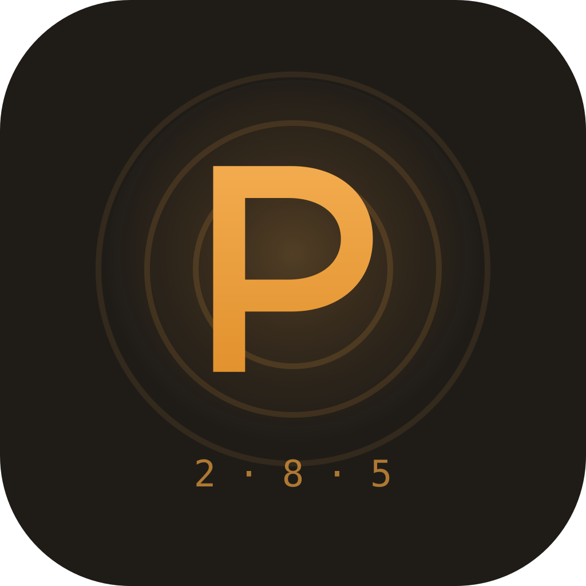

# Brand explorations — the mark

The 30 candidates the electron-shell mark — a drawn "P" inside phosphorus's
three electron shells, `2 · 8 · 5` beneath in the mono face — was chosen from,
preserved as the palette of **sanctioned variations**. It won on the day the
app took the Phosphor name: the retired aperture said "one orchestrator, many
agents", the shell says the name itself. Pull
from here for campaign art, easter eggs, or a future revision — don't sketch
from zero. Every candidate keeps the brand DNA: graphite tile `#1f1c18`,
amber gradient `#f2ab4e → #e2922e`, a `radialGradient` bloom (never stacked
circles), tile radius 228/1024.

Three rounds: ten directions, then ten descendants of each finalist
direction (the Flame, Element 15). The winner is **Element 15 #10 — Electron
Shell**, now `build/icon.svg`.

## Round one — ten directions

The name finally means something the aperture never said: phosphorus ignites,
matches strike, CRT phosphor glows.

|                                                                                                                                                                               |                                                                                                                                                                              |                                                                                                                                                                                                     |
| :---------------------------------------------------------------------------------------------------------------------------------------------------------------------------: | :--------------------------------------------------------------------------------------------------------------------------------------------------------------------------: | :-------------------------------------------------------------------------------------------------------------------------------------------------------------------------------------------------: |
|       **01 The Match** The most literal read: struck match, head in full phosphor. Instantly nameable at 22px.       |      **02 The Strike** The moment of ignition — a strike streak sweeping into a burst. Motion in a still mark.     |                     **03 The Flame** One teardrop flame, flame-shaped cutout, hot center. Finalist — spawned round two.                    |
|  **04 The Ember Ring** The aperture's direct descendant: six segments, each now a flame lick. Safest evolution. |  **05 Element 15** Phosphorus as a periodic-table cell. The most ownable read. Finalist — spawned round three. |  **06 The Scanline Flame** The flame drawn the way a CRT would draw it — fire rendered by the screen tech the brand is named for. |
|                       **07 The Wick** A candle at desk scale — the "long-running session" read.                       |      **08 The Spark** Six points — the ring's segment count as a burst; the working-spark promoted to identity.     |                      **09 Flame in the Aperture** Today's exact ring with a flame core. Zero-risk option.                      |
|                **10 The Ignition** The match mid-ignition, sparks lifting off. The most narrative.                |                                                                                                                                                                              |                                                                                                                                                                                                     |

## Round two — the Flame, ten ways

Descendants of #03. Levers: silhouette (slender ↔ round ↔ faceted), symmetry,
what the core is (hole, ember, spark), and whether anything frames the flame.

|                                                                                                                                                                         |                                                                                                                                                     |                                                                                                                                                                 |
| :---------------------------------------------------------------------------------------------------------------------------------------------------------------------: | :-------------------------------------------------------------------------------------------------------------------------------------------------: | :-------------------------------------------------------------------------------------------------------------------------------------------------------------: |
|                       **01 Candle** Pulled tall and sharp — a steady burn, not a blaze.                      |  **02 The Flick** The tip whips right; the only asymmetric one, strongest at large sizes. |  **03 Twin Tongue** A second lick beside the main flame — keeps the orchestrator + agent story. |
|               **04 Nested** Three concentric flames — heat as contour lines. Merges below 32px.              |           **05 Hollow** A rim of fire around darkness; maximum negative space.           |  **06 Molten Core** No cutout — a near-white hot inner flame. The only one adding a third tone. |
|  **07 Rising Spark** An ember lifting in three steps inside the cutout — the streaming state drawn in. |                   **08 The Drop** Compressed and round — best below 32px.                  |                   **09 Faceted** The flame cut like a gem; precision over warmth.                   |
|   **10 Ringed** The flame in one thin unbroken ring — the aperture's ghost, strongest monochrome fallback.   |                                                                                                                                                     |                                                                                                                                                                 |

## Round three — Element 15, ten ways

Descendants of #05, all sharing one drawn "P" letterform (a path, not a
font). Levers: how much of the cell survives, what the counter holds, how
much chemistry the mark admits.

|                                                                                                                                                                                 |                                                                                                                                                              |                                                                                                                                                      |
| :-----------------------------------------------------------------------------------------------------------------------------------------------------------------------------: | :----------------------------------------------------------------------------------------------------------------------------------------------------------: | :--------------------------------------------------------------------------------------------------------------------------------------------------: |
|                       **01 Bare P** No cell — the P and a superscript 15, like isotope notation.                       |  **02 Full Cell** Number, symbol, name, mass 30.974. Maximum chemistry; labels vanish in a dock. |          **03 Corner Brackets** The cell reduced to four viewfinder ticks.         |
|   **04 Flame Counter** The P's counter is a flame cutout with an ember — the letter and the fire in one glyph.  |     **05 Negative P** Solid amber tile, P knocked out to graphite. Boldest from a distance.     |       **06 Scanline P** Phosphorus rendered by phosphor — the P in CRT scanlines.       |
|           **07 Afterglow** The P with its phosphorescent ghost — persistence, sessions that keep burning.           |      **08 Split 15** Editorial: P left, 15 stacked right behind a hairline. Masthead energy.      |  **09 In the Aperture** The old ring with the P as core — the gentlest transition. |
|  **10 Electron Shell — CHOSEN ✓** The P inside phosphorus's shells, `2 · 8 · 5` beneath. Now `build/icon.svg`. |                                                                                                                                                              |                                                                                                                                                      |

## Using a variation

- The chosen mark is the identity; a variation is an accent, not a substitute
  — don't ship one as an app icon or in chrome.
- Editing a variation: keep the DNA invariants at the top of this file, and
  keep the SVG self-contained (its gradient ids are already unique per file).
- If a future revision replaces the mark, add the round here rather than
  deleting one — this file is the record of what was considered and why.
