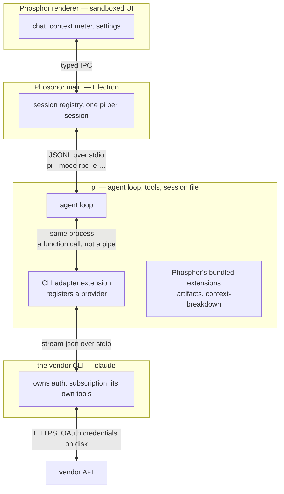

# 14 — Subscription CLIs as pi providers

Phosphor reaches a paid coding agent through its **own CLI**, spending the
user's subscription instead of an API key. One has shipped:
`@saccolabs/pi-claude-cli`, which drives Claude Code. This document is the
Phosphor-side contract for it, why it is shaped that way, and why there is no
Codex equivalent.

## Current Claude integration

Phosphor requires **`pi-claude-cli >= 0.9.0`**. pi owns the prompt, active tools,
conversation and compaction. The official Claude Code CLI supplies model access
and subscription authentication, not a second coding-agent configuration.

`claudeProviderSpawnEnv` sets `PI_CLAUDE_CLI_CONTEXT=pi` on every pi spawn so an
inherited legacy policy cannot change behavior when a session switches to Claude.
The provider uses pi's system prompt, advertises only the request's tools through
MCP, and executes every tool in pi, including read/edit/bash. Native Claude tools,
independent memory/skill/MCP discovery and CLI compaction are disabled. Explicit
host guards and managed policy remain in force; bare mode is not used.

One warm CLI process serves matching follow-ups and pi tool handoffs. It is a
disposable cache: model switches, changed prompts/tools, branch rewrites and
compaction retire it. Returning to Claude imports pi's current context, including
native-provider turns. No new Claude transcript or resume sidecar is written.
Imports use role-labelled text plus images because the CLI print interface is
not a direct structured-history API; this is continuity, not identical wire input.

- **An account is a config directory.** `CLAUDE_CONFIG_DIR` and
  `CLAUDE_SECURESTORAGE_CONFIG_DIR` scope the CLI's config and keychain entry,
  so Phosphor holds several Claude logins and picks one per session at spawn
  (`electron/claude/`; routing modes `specific | ordered | round-robin`, with
  cooldowns keyed off the window each account last exhausted). The credential
  is fixed for the life of the process; moving a lane is a respawn.
- **Account state never enters turn content.** Rate limits arrive on the
  `claude-rate-limit` status key
  ([extensions.md](extensions.md#the-status-channel-is-a-wire-contract)).
- **Model list comes from pi**, not the CLI
  ([extensions.md](extensions.md#updating-the-cli-does-not-add-new-models)).
- **One-shots pass `claudeOneShotEnv()`.** Every `pi -p` spawn sets
  `PI_CLAUDE_CLI_KEEPALIVE_MS=0`, or the warm child keeps the run alive for ten
  minutes after it has printed its answer. The same env sets
  `PI_CLAUDE_CLI_EPHEMERAL=1`. Under pi ownership the provider writes no CLI
  transcript, session-map entry or stored prompt anyway; the flag stops a
  provider running the legacy policy from saving all three for every naming
  run.

Phosphor checks the package version before starting or switching to Claude.
The provider must be published and installed separately; Phosphor installs or
upgrades nothing implicitly. Claude Code 2.1.263+ is required.

### Compaction has one owner

pi owns compaction for every provider. Phosphor does not force a different
setting at spawn or model switch. The Agent settings and session toggle apply
to Claude too, and the context meter uses pi's model window. The old Claude-only
context-window preference is retained for config compatibility but is no longer
shown, passed to the provider, or used by the meter.

### Existing sessions

The provider automatically detaches an old Claude pairing on the next default
request and imports the current pi history. No manual reset or fresh pi session
is needed. Old Claude transcripts are retained as archives, never resumed.
Historical native-tool markers may contain only previews; missing historical
results cannot be recovered from those pi records. New tool calls/results are
normal pi messages. Legacy markers and rebuild UI remain readable for old records.

## Why a bridge for Claude, and not for Codex

Both vendors sell a subscription with an OAuth flow. Only one lets a
third-party client use it.

| Vendor        | Using the subscription's OAuth token in your own client                                     | Therefore                                         |
| ------------- | ------------------------------------------------------------------------------------------- | ------------------------------------------------- |
| **Anthropic** | **Prohibited** for Free/Pro/Max tokens, and blocked server-side                             | The official binary is the only path → **bridge** |
| **OpenAI**    | **Permitted**; pi is named by the Codex lead as a supported client for Sign in With ChatGPT | pi's native provider is the sanctioned path       |

What Anthropic prohibits is **token extraction**: lifting a subscription
credential into a client that is not Claude Code. It does not prohibit driving
the official binary; Anthropic's own help pages name `claude -p` and
third-party app usage as supported ways to spend a subscription. So
`pi-claude-cli` is not one option among several. It is the only way to reach a
Claude plan from Phosphor, precisely because it delegates to the official
client rather than borrowing its credentials.

For Codex, pi already ships the ChatGPT OAuth flow and the `openai-codex`
provider against the same backend the binary uses, exposed as an ordinary pi
provider with `/login`. A CLI bridge would add only Codex's own harness
(sandboxing and approval gates), which is machinery pi would suppress rather
than use. **No `pi-codex-cli` is planned.** Revisit only if a capability turns
up that is reachable through the binary and not the backend.

The load-bearing design decision either way: **the adapter is a pi extension,
not a Phosphor feature.** It registers a provider inside pi's process. Phosphor
learned nothing, and `shared/rpc.ts` did not change once.

## Accounts, in Phosphor

Settings → **Accounts** (`tabs/AccountsTab.tsx`) lists the providers pi can
sign into: `openai-codex`, `anthropic`, `github-copilot`, `kimi-for-coding` as
subscriptions, then `xai`, `openrouter`, `radius` as per-token balances. Each
row is a button, a browser tab, and a flip to "Signed in".

pi's `/login` is **TUI-only** (no `pi auth login`, no RPC auth command), so
`electron/pi/login-flow.ts` drives that TUI off-screen in a pty and parses its
rendering into structured state. Two sign-in shapes are handled: device code
(the user is shown a code) and loopback redirect (pi runs its own callback
server, no code at all). `pi:loginTerminal` is the escape hatch for a provider
whose prompts the driver does not recognise. The provider list is hand-curated
in `electron/pi/auth-status.ts`, each id verified against
`pi auth check --provider`.

Claude logins are a separate set, under Extensions → Claude Code
([settings.md](settings.md#claude-code-pi-claude-cli)), because they are
config directories, not pi credentials.

## Two live risks

Both dated and checkable.

**`--bare` will become the default for `-p`.** Claude Code's help describes
`--bare` as a minimal mode where auth is strictly `ANTHROPIC_API_KEY` and
OAuth is never read. `pi-claude-cli` does not pass `--bare`, which is why it
works on a subscription at all. **Never adopt `--bare` as a stronger hermetic
mode**: it would turn every session from "uses your plan" into "requires an
API key". If the `-p` default flips before an opt-out exists, the provider
breaks with an auth error.

**Subscription metering for programmatic use keeps moving.** Anthropic has
announced, reinstated and paused a separate "Agent SDK credits" pool for
`claude -p` and third-party use. Today `claude -p` still draws on the plan's
own limits. If separate metering lands, the bridge keeps working and the
economics change; the plan-limits chip would then need to report the credit
pool instead of the five-hour window. Anthropic has committed to advance
notice, so this is a watch item, not a reason to build defensive machinery.

## What is left to build

- **Extract the kit.** The CLI-agnostic half of `pi-claude-cli` (process
  lifecycle, index re-basing, tool arbitration, account registry, status-key
  publisher) into a shared bridge package, with `pi-claude-cli` as a thin
  adapter whose existing tests are the acceptance criteria.
- **Generalise multi-account.** Routing, per-session binding and cooldowns
  shipped for Claude in Phosphor main and are spelled `claude*`. Lift them
  over the two account shapes (a config directory for a CLI-backed provider; a
  credential record in pi's auth store for a natively OAuthed one) so a second
  CLI-backed provider re-implements none of it.
- **Guard the two risks above.** A startup assertion that the spawned
  `claude` is not running bare, and a check that the plan-limits payload
  still describes subscription usage.

Open: whether pi's native `openai-codex` provider can surface plan limits.
`pi auth check --json` reports readiness and, for a token that says so, an
account email, but nothing about a plan, for any provider.

## Sources

- [Use the Claude Agent SDK with your Claude plan](https://support.claude.com/en/articles/15036540-use-the-claude-agent-sdk-with-your-claude-plan)
  — the credit-pool announcement and its pause; `claude -p` still draws on
  subscription limits today
- [Run Claude Code programmatically](https://code.claude.com/docs/en/headless)
  — `--bare` skips OAuth and needs `ANTHROPIC_API_KEY`
- [Anthropic clarifies ban on third-party tool access](https://www.theregister.com/2026/02/20/anthropic_clarifies_ban_third_party_claude_access/)
  — subscription OAuth is Claude Code and claude.ai only
- [Tibo Sottiaux on supported Codex usage](https://x.com/thsottiaux/status/2090675027670978569)
  — Sign in With ChatGPT through OSS clients is fine; pi named explicitly
- [Using Codex with your ChatGPT plan](https://help.openai.com/en/articles/11369540-using-codex-with-your-chatgpt-plan)
- [pi providers doc](https://github.com/earendil-works/pi/blob/main/packages/coding-agent/docs/providers.md)
  — registering a full `Provider` from an extension

Related: [extensions.md](extensions.md) for the extension and status-key
contracts, [chat.md](chat.md) for how provider-specific block shapes render.
