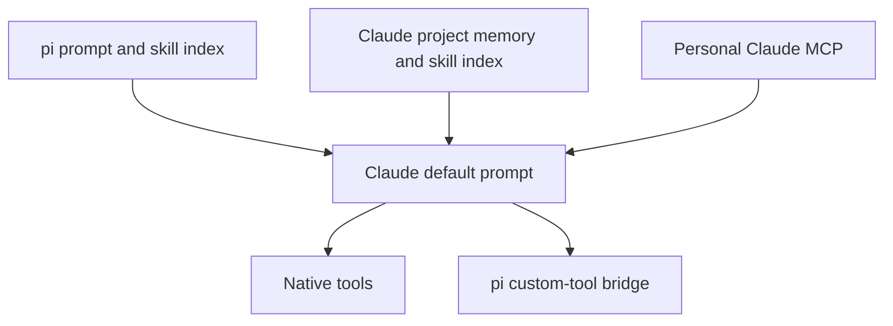
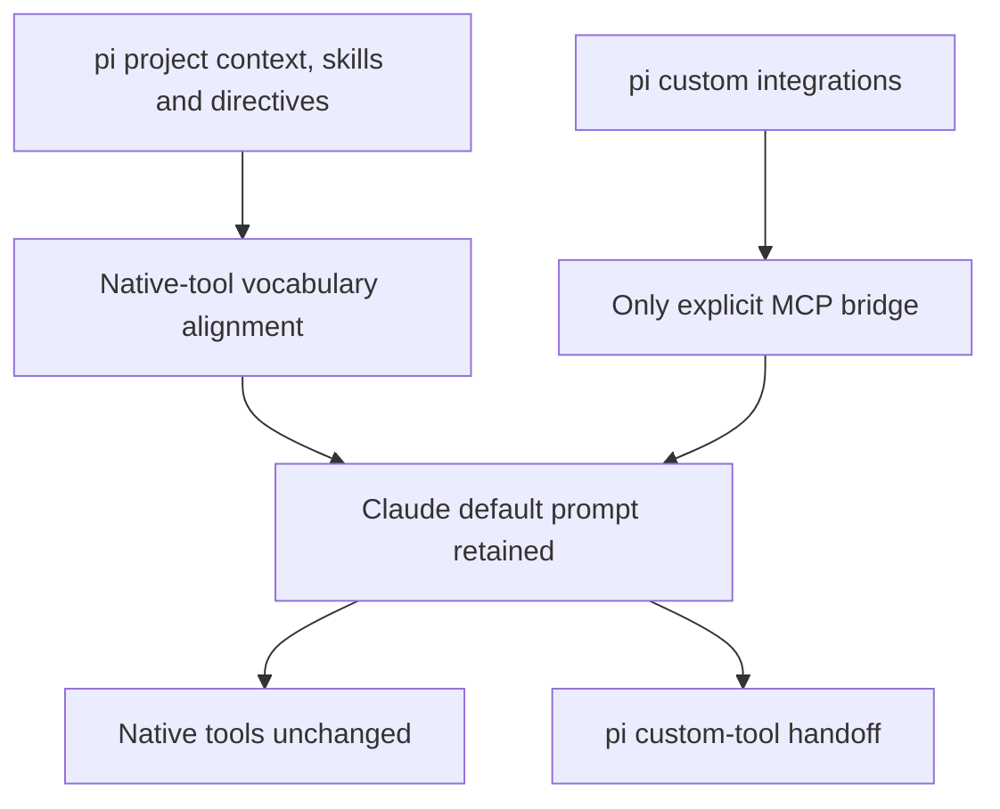

# Claude context alignment, without replacing native tools

## Decision

Clean up duplicate context discovery first. Keep Claude Code's default prompt,
native Read/Edit/Bash/etc., native agents, subscription authentication, and
persistent process. Replacing the coding toolset remains a separate, evaluated
proposal, not part of this change.

## Ownership

| Layer                                     | Native pi provider      | Claude CLI provider                                    |
| ----------------------------------------- | ----------------------- | ------------------------------------------------------ |
| Project files and skill index             | pi                      | pi                                                     |
| Phosphor directives and artifact guidance | pi                      | pi, preserved in the appended prompt                   |
| Core tool vocabulary                      | pi's actual schemas     | Provider aligns generated guidance to Claude's schemas |
| Custom integrations                       | pi packages/MCP adapter | Same pi tools through the explicit MCP bridge          |
| Base operating prompt / basic execution   | Native pi provider loop | Claude default prompt / native tools, unchanged        |
| Conversation and compaction               | pi                      | Still pi and Claude ledgers; not unified               |

## What changed

- Every non-stub session gets `PI_CLAUDE_CLI_CONTEXT=pi` and strict MCP, even
  when starting on a native provider. Other providers ignore these variables.
- Session creation no longer suppresses pi context-file discovery. A later
  provider switch therefore does not silently lose project instructions.
- Before starting/switching to Claude, Phosphor requires declared, installed,
  stable provider packages at **0.7.1+**. It also checks the resolved model
  before each prompt, covering fuzzy model selection that spawn prediction
  cannot know. It refuses old, missing/unversioned,
  prerelease and mixed unsupported installs with an actionable update message.
  This is a conservative package check, not an arbitrary extension-code audit.
- `pi-claude-cli` owns the launch profile, prompt alignment and saved-policy
  check, and requires Claude Code **2.1.263+** for the tested isolation controls. Its corresponding release must land first; Phosphor does not install
  or modify the user's package or Claude settings automatically.
- The generated subagent policy now distinguishes Claude `Agent` from pi
  `subagent`. It no longer claims every CLI dies at turn end or tells pi tools
  to accept Claude-specific arguments. Settings and main use the same shared
  policy function. User-authored directive text is not rewritten.

The provider's opt-in profile uses empty user/project/local settings sources,
disables native skill commands and independent CLAUDE.md/auto-memory loading,
disables Claude's own connectors, and keeps the explicit pi MCP bridge. It
**does not** use `--bare`, replace Claude's default prompt, disable native coding
tools, or blanket-disable hooks. Explicit host `--settings` guards and managed
policy remain honored.

The provider changes only the recognized generated pi preamble. Artifact
rules/custom-tool guidance survive, while user directives, project contents,
skill indexes and `.pi` paths in the suffix are preserved byte-for-byte.
Pi's multi-edit instructions are not presented as Claude Edit semantics.
Search guidance is conditional: the live Haiku inventory did not contain
Grep/Glob, so those names are not advertised from pi's registry alone. Use
native search tools only when present, otherwise Bash.

## Rollout and existing sessions

1. Publish/install provider 0.7.1+ from the provider PR.
2. Release this Phosphor integration.
3. Start fresh pi sessions. The provider refuses a context-policy change
   against an old saved Claude prompt rather than silently reimporting a
   transcript that pi does not completely own. Existing sessions are not deleted.

Standalone Claude Code is unaffected. Native pi tools/providers are unchanged.
One-shot naming retains its separate minimal prompt policy. This does not make
native Claude tools subject to pi extension vetoes, and does not guarantee
identical model quality or complete visibility into Claude's request context.

## Validation evidence

- Phosphor unit tests cover session creation, version rejection before spawn,
  native-to-Claude switching, native-provider independence, and directive text.
- Full Phosphor validation includes typecheck, lint, format, unit tests, build,
  and the Playwright-Electron suite against the pi stub.
- Provider tests cover generated-prompt preservation, launch controls, retained
  host settings/native tools, saved-policy errors, and warm continuity.
- A separate **real Claude 2.1.263 / Haiku 4.5** fixture passed: native Read,
  pi skill loading, a real pi handoff, host hook execution, no foreign project
  hook/MCP execution, zero native skills, only `custom-tools` as an MCP server,
  and one model process across two turns. Foreign memory/skill/agent sentinels
  were absent from its saved CLI transcript. The installed CLI reported
  `claude.ai` subscription authentication; no API-key or cloud-backend
  overrides were present in the test shell.
- Final fixture append: **1,537 characters**. Reported input context: **38,948 →
  39,124 tokens**; follow-up cache read: **38,938**. These are not production
  savings figures: they include retained Claude/runtime overhead and do not
  measure the component sizes of its full API request. The context meter still
  displays estimates and was not redesigned in this change.
